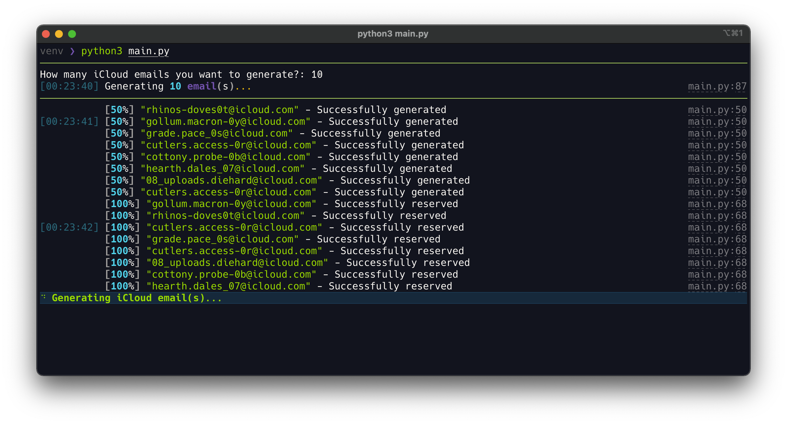

# Icloud_generator
<p align="center"></p>

> HideMyEmail orqali Apple iCloud elektron pochta xabarlarini avtomatik yaratish.

_ICloud elektron pochta xabarlarini yaratish uchun siz faol iCloud+ obunasiga ega bo'lishingiz kerak..._

<p align="center"></p>

## Foydalanish

Apple sizga har 1 soatda iCloud oilangizda 5 tadan iborat elektron pochta xabarlarini yaratishga imkon beradi. Mening tajribamga ko'ra, 1 ta akkaunt uchun jami siz yaratishingiz mumkin bo'lgan iCloud elektron pochta xabarlari miqdorini ~ 750 ga taga teng.

## Sozlash; o'rnatish
> Python 3.12+ talab qilinadi!

1. Ushbu omborni klonlash

```bash
git clone https://github.com/JMSM0707/Icloud_generator.git
```

2. Kutubxonalarni o'rnatish talablari

```bash
pip install -r requirements.txt
```
Yoki shunchaki START.bat fayliga ikki marta bosing.

3. [Save your cookie string](https://github.com/rtunazzz/hidemyemail-generator#getting-icloud-cookie-string)

   > Buni faqat bir marta qilishingiz kerak 🙂

4. Endi skriptni quyidagi bilan ishga tushirishingiz mumkin:


**on Mac:**

```bash
python3 main.py
```

**on Windows:**

```bash
python main.py
```
Yoki shunchaki START.bat fayliga ikki marta bosing.

## iCloud cookie fayli olish

> Kerakli cookie-fayllarni olishning bir nechta usullari mavjud, ammo bu eng oddiy usul:

1. Chrome kengaytmasini yuklab oling [EditThisCookie](https://chromewebstore.google.com/detail/editthiscookie-v3/ojfebgpkimhlhcblbalbfjblapadhbol)

2. Kengaytmaga o'ting va kerakli eksport formatini o'rnating `Semicolon separated name=value pairs`
3. [EditThisCookie settings page](chrome-extension://fngmhnnpilhplaeedifhccceomclgfbg/options_pages/user_preferences.html)  `Semicolon separated name=value pairs`

<p align="center"></p>

3. Brauzeringizda [iCloud sozlamalari](https://www.icloud.com/settings/) ga o'ting va tizimga kiring.

4. EditThisCookie kengaytmasini bosing va cookie-fayllarni eksport qiling

<p align="center"></p>

5. Eksport qilingan cookie-fayllarni `cookie.txt` nomli faylga joylashtiring
